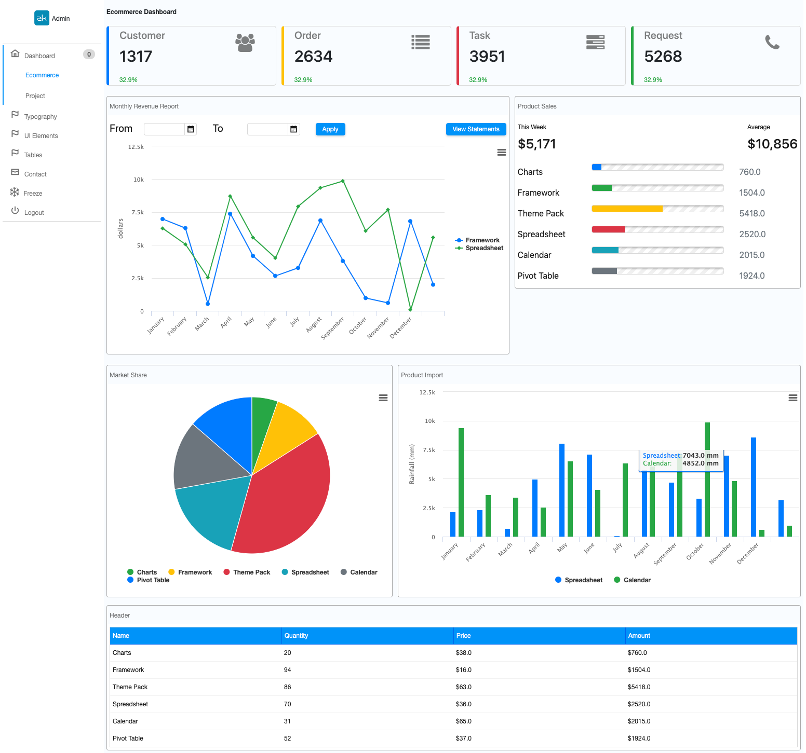
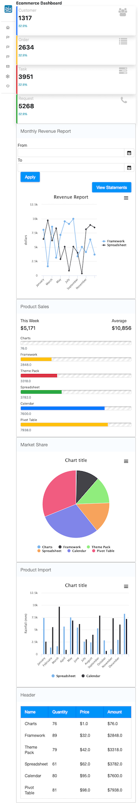

# This project can show you

* build an administration system with ZK components
* develop with MVVM pattern
* various usages of shadow elements
* apply responsive design with Bootstrap and ZK
* create a custom component with shadow elements

# Screenshots
3 different screen width:

## Large

## Medium

## Small

## detail
This project integrates with the following 3rd party frameworks/resources:
* [Bootstrap 4.3.1](https://getbootstrap.com/)
* [Font Awesome·4.7.0.](https://fontawesome.com/v4.7.0/icons/): bundled with ZK framework (since 8.5.2)

It includes Bootstrap with [Webjars](https://www.webjars.org/).

# How to Run
## No Maven
You can run the project with maven wrapper by the command below (it will automatically download required maven):

### Linux/Mac
`./mvnw jetty:run`
### Windows
`mvnw jetty:run`

## With Maven installed
With the command below:

`mvn jetty:run`

After the jetty started
visit [http://localhost:8080](http://localhost:8080/admin-template)

# Browser compatibility
* Chrome 49
* Edge 15
* Firefox 31
* Opera 36
* Safari
* All mobile browsers

* since this project uses [CSS custom properties](https://developer.mozilla.org/en-US/docs/Web/CSS/Using_CSS_custom_properties).