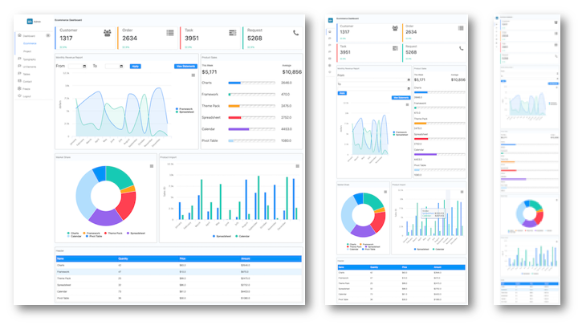

# ZK admin template project 
This project can show you:

* build an administration system with ZK components
* develop with MVVM pattern
* reusing view snippet as a template
* easily apply responsive design (RWD) with Bootstrap
* create a custom component with shadow elements

# [Online Demo](https://www.zkoss.org/admin-template/)

# Screenshots
3 different screen width:

## detail
This project integrates with the following 3rd party frameworks/resources:
* [Bootstrap 4.3.1](https://getbootstrap.com/). Customize color with [themestr.app](https://themestr.app/theme)

Why not using [Bootstrap 5](https://mdbootstrap.com/bootstrap-5/)? Since it's not released at the moment we create this project.
* [Font Awesome·4.7.0.](https://fontawesome.com/v4.7.0/icons/): bundled with ZK framework (since 8.5.2)

This project includes Bootstrap with [Webjars](https://www.webjars.org/).

# How to Run
## No Maven
You can run the project with gradle wrapper by the command below (it will automatically download required files):

### Linux/Mac
`./gradlew appRun`
### Windows
`gradlew appRun`

## With Maven installed
With the command below:

`mvn jetty:run`

After the jetty started
visit [http://localhost:8080/admin-template/](http://localhost:8080/admin-template)

# Browser compatibility
* Chrome 49
* Edge 15
* Firefox 31
* Opera 36
* Safari
* All mobile browsers

Since this project uses [CSS custom properties](https://developer.mozilla.org/en-US/docs/Web/CSS/Using_CSS_custom_properties).

# Publish

jenkins2/job/update_war/